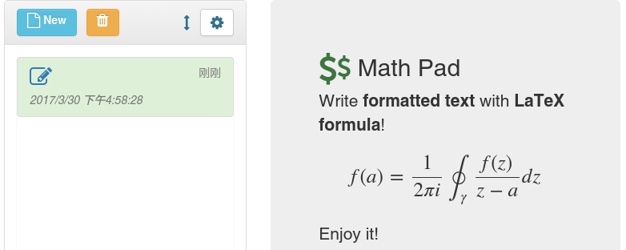
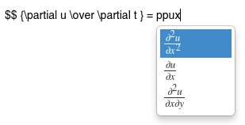
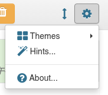
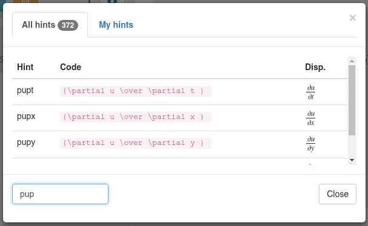

# MathPad
Write formatted text anywhere with LaTeX formula.

> Try now, [MathPad](https://zhuangbo.github.io/MathPad/MathPad.html)

Now you can take notes in rich text format with a nice LaTeX formula on a computer, tablet or phone, anytime, anywhere.

## Features

  * Write **formatted text** with **LaTeX formula**.
  * Saved in **local storage** of browser.
  * **Any device** (desktop, tablet or phone).
  * Super **lightweight** (generally &lt;1K (370B), about 448K for first time).
  * LaTeX **code hints** (370+, e.g. `dd` `beq`...) + **user-defined hints** (define your own code hints).

 Note: Do **NOT** insert **new line** inside a LaTeX formula. Because new line will be considered as a new paragraph, which will break the formula.

## Online usage

In short, open [MathPad](https://zhuangbo.github.io/MathPad/MathPad.html) and enjoy it.

  1. Open [MathPad](https://zhuangbo.github.io/MathPad/MathPad.html) on your desktop, tablet or phone with a modern browser.
  2. Create a **new** note and **edit** it. You can use rich text format and beautiful Latex math formulas.
  3. You can use the **mouse** or **finger** to slide the window to toggle between browsing, editing and preview. Slide up and down on the computer and the tablet, but left and right on the phone.
  4. Your notes are kept in the browser's **local store** until you delete it.

## Offline usage

In short, [download](https://github.com/zhuangbo/MathPad/archive/master.zip) and enjoy it.

You can [download](https://github.com/zhuangbo/MathPad/archive/master.zip) it directly to your device and use all of its features, exactly the same as online. It is worth noting that your device must be able to access the network in order to automatically download the required libraries.

## Print

You can print your notes at the time of preview, or even export PDF files by PDF printer (e.g. [Bullzip](http://www.bullzip.com/products/pdf/info.php) a free PDF printer).

## Privacy

Your notes will not be uploaded to any network device. They are kept in the browser's **local store** on your device. Its security is equivalent to the security of your device. In addition, your notes will NOT be shared between different browsers on the same device.

## LaTeX code hints

We use LaTeX hints like [TeXWorks](https://www.tug.org/texworks/) and greatly expanded this featuer. More than 370 code hints are predefined in order to facilitate the input of mathematical formulas. In particular, in most cases, the corresponding LaTeX formula will be displayed intuitively in the prompt menu, which provides an unprecedented writing experience.

You can define your own code hints in the "Hints" dialog in the following format:
  * `(hint) ## (code) [## [display] ## [display phone]]`

to replace `(hint)` with `(code)` and display `[display]` or `[display phone]` (phone only) in the menu. Here are some examples.
  * `xa ## \alpha` （Replace `xa` with `\alpha`)
  * `sqrt ## \sqrt{ } ## sqrt` (Replace `sqrt` with `\sqrt`, show `sqrt` in menu)
  * `rq ## {-b\pm\sqrt{b^2-4ac} \over 2a} ## ## root of quadr. eq` (Replace `rq` with the root of a quadratic equation, show `root of quadr. eq` in menu at phone)

 Some code hints are listed below. To get a complete list of code hints, check the "Hints" dialog in the settings.

 

### Begin environments

|	Type	|	Got	|	Type	|	Got	|
|	----	|	----	|	----	|	----	|
|	`barr`	|	array	|	`bgath`	|	gather	|
|	`bali`	|	align	|	`bgaths`	|	gather*	|
|	`balis`	|	align*	|	`bgathed`	|	gathered	|
|	`baliat`	|	alignat	|	`bgathedo`	|	gathered	|
|	`baliats`	|	alignat*	|	`bmat`	|	matrix	|
|	`balied`	|	aligned	|	`bmult`	|	multline	|
|	`bbmat`	|	bmatrix	|	`bmults`	|	multline*	|
|	`bbmat2`	|	Bmatrix	|	`bpmat`	|	pmatrix	|
|	`bcase`	|	cases	|	`bsplit`	|	split	|
|	`bequ`	|	equation	|	`bsubeq`	|	subequations	|
|	`bequs`	|	equation*	|	`bvmat`	|	vmatrix	|
|	`beqn`	|	eqnarray	|	`bvmat2`	|	Vmatrix	|
|	`beqns`	|	eqnarray*	|		|		|

### Greek

|	Type	|	Got	|	Type	|	Got	|	Type	|	Got	|	Type	|	Got	|
|	----	|	----	|	----	|	----	|	----	|	----	|	----	|	----	|
|	`xa`	|	alpha	|	`xph`	|	phi	|	`dxa`	|	\\(alpha\\)	|	`dxph`	|	\\(phi\\)	|
|	`xb`	|	beta	|	`xcph`	|	Phi	|	`dxb`	|	\\(beta\\)	|	`dxcph`	|	\\(Phi\\)	|
|	`xch`	|	chi	|	`xvph`	|	varphi	|	`dxch`	|	\\(chi\\)	|	`dxvph`	|	\\(varphi\\)	|
|	`xd`	|	delta	|	`xps`	|	psi	|	`dxd`	|	\\(delta\\)	|	`dxps`	|	\\(psi\\)	|
|	`xcd`	|	Delta	|	`xcps`	|	Psi	|	`dxcd`	|	\\(Delta\\)	|	`dxcps`	|	\\(Psi\\)	|
|	`xe`	|	epsilon	|	`xs`	|	sigma	|	`dxe`	|	\\(epsilon\\)	|	`dxs`	|	\\(sigma\\)	|
|	`xve`	|	varepsilon	|	`xcs`	|	Sigma	|	`dxve`	|	\\(varepsilon\\)	|	`dxcs`	|	\\(Sigma\\)	|
|	`xet`	|	eta	|	`xvs`	|	varsigma	|	`dxet`	|	\\(eta\\)	|	`dxvs`	|	\\(varsigma\\)	|
|	`xg`	|	gamma	|	`xz`	|	zeta	|	`dxg`	|	\\(gamma\\)	|	`dxz`	|	\\(zeta\\)	|
|	`xcg`	|	Gamma	|	`xr`	|	rho	|	`dxcg`	|	\\(Gamma\\)	|	`dxr`	|	\\(rho\\)	|
|	`xio`	|	iota	|	`xvr`	|	varrho	|	`dxio`	|	\\(iota\\)	|	`dxvr`	|	\\(varrho\\)	|
|	`xl`	|	lambda	|	`xt`	|	tau	|	`dxl`	|	\\(lambda\\)	|	`dxt`	|	\\(tau\\)	|
|	`xcl`	|	Lambda	|	`xth`	|	theta	|	`dxcl`	|	\\(Lambda\\)	|	`dxth`	|	\\(theta\\)	|
|	`xm`	|	mu	|	`xcth`	|	Theta	|	`dxm`	|	\\(mu\\)	|	`dxcth`	|	\\(Theta\\)	|
|	`xn`	|	nu	|	`xvth`	|	vartheta	|	`dxn`	|	\\(nu\\)	|	`dxvth`	|	\\(vartheta\\)	|
|	`xo`	|	omega	|	`xu`	|	upsilon	|	`dxo`	|	\\(omega\\)	|	`dxu`	|	\\(upsilon\\)	|
|	`xco`	|	Omega	|	`xcu`	|	Upsilon	|	`dxco`	|	\\(Omega\\)	|	`dxcu`	|	\\(Upsilon\\)	|
|	`xp`	|	pi	|	`xx`	|	xi	|	`dxp`	|	\\(pi\\)	|	`dxx`	|	\\(xi\\)	|
|	`xcp`	|	Pi	|	`xcx`	|	Xi	|	`dxcp`	|	\\(Pi\\)	|	`dxcx`	|	\\(Xi\\)	|
|	`xvp`	|	varpi	|		|		|	`dxvp`	|	\\(varpi\\)	|		|		|

### Math fonts and others

|	Type	|	Got	|	Type	|	Got	|
|	----	|	----	|	----	|	----	|
|	`mbf`	|	mathbf	|	`dd`	|	\\( \\)	|
|	`mrm`	|	mathrm	|	`frac`	|	frac	|
|	`mcal`	|	mathcal	|	`sqrt`	|	sqrt	|
|	`msf`	|	mathsf	|	`sqrto`	|	sqrt[]	|
|	`mtt`	|	mathtt	|	`ref`	|	ref	|
|	`mit`	|	mathit	|	`eqref`	|	eqref	|

## Build on

  * [MathJax](https://www.mathjax.org/) -- Beautiful math in all browsers.
  * [Summernote](http://summernote.org/) -- Super simple WYSIWYG editor on Bootstrap.
  * [Bootstrap](http://getbootstrap.com/) -- The most popular HTML, CSS, and JS framework.
  * [jQuery](https://jquery.com/) -- The write less, do more, JavaScript library.
  * [fullPage.js](http://alvarotrigo.com/fullPage/) -- Create beautiful fullscreen scrolling websites.
  * [store.js](https://github.com/marcuswestin/store.js) -- Cross-browser storage for all use cases.
  * [Pretty Date](http://fengyuanchen.github.io/prettydate/) -- A simple jQuery date prettify plugin.
  * [jQuery.print](https://github.com/DoersGuild/jQuery.print) -- Easy to use, Element Printing Plugin for jQuery.
